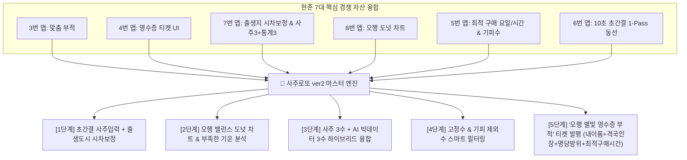
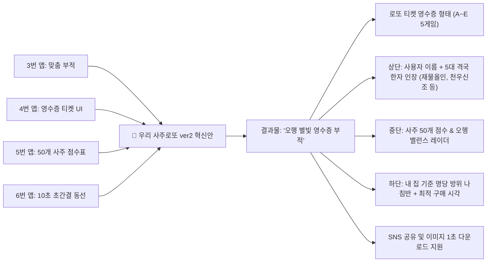

# 🔮 사주-로또 경쟁 플랫폼 심층 벤치마킹 분석 보고서 (Master)

본 문서는 구글 플레이스토어에 등록된 **'사주-로또' 융합 및 유사 운세·복권 플랫폼 40개**를 전수 조사하여, 다운로드 순위, 메뉴 구성, 화면 체계(Tree 구조), 페이지 수 및 뎁스(Depth), UI/UX 복잡도, 템플릿의 장단점을 하나하나 접속하여 세밀하게 해부하는 마스터 분석서입니다.

---

## 📊 [전체 분석 대상 40대 플랫폼 마스터 로드맵]

| 순번 | 앱 이름 (한글) | 패키지명 (ID) | 개발사 | 다운로드 규모 | 평점 | 분석 상태 |
| :---: | :--- | :--- | :--- | :---: | :---: | :---: |
| **01** | **로또AI 사주, 꿈해몽** | `com.tsmall.lotto` | James Jung | **5,000+** | 4.5★ | 🟢 **1차 정밀 분석 완료** |
| **02** | **오늘운세 로또 꿈 사주 궁합** | `kr.co.application.kkangjiunse` | kkangji | **5,000+** | 4.7★ | 🟢 **2차 정밀 분석 완료** |
| **03** | **로또사주** | `net.dfocus.lottosaju` | Peter Han | **1,000+** | 3.1★ | 🟢 **1차 정밀 분석 완료** |
| **04** | **오늘의 로또 (운세·복권)** | `com.teddy_park.today_lottery` | TeddyPark | **1,000+** | 4.7★ | 🟢 **2차 정밀 분석 완료** |
| **05** | **운세N (사주·타로·로또)** | `com.unsen.app` | unsen | **1,000+** | 4.4★ | 🟢 **3차 정밀 분석 완료** |
| **06** | **2026 사주로또 - 사주 AI 로또 추천** | `com.koko.sajulotto` | KOKO COMPANY | **100+** | 5.0★ | 🟢 **3차 정밀 분석 완료** |
| **07** | **오늘의 로또운세 (스윙투앱)** | `com.swing2app.v3.dee24767bc...` | swing2app | **100+** | - | 🟢 **4차 정밀 분석 완료** |
| **08** | **행운 사주 로또** | `com.turtlebox.gold` | Turtle Box | **50+** | 5.0★ | 🟢 **4차 정밀 분석 완료** |
| **09** | **로또 번호추천 (사주·당첨통계)** | `com.smartier77.lottostat` | smartier77 | **50+** | - | 🟢 **4차 정밀 분석 완료** |
| **10** | **사주로또 (운세·구매시간)** | `com.hadam.lottosaju` | Hadam Studio | **10+** | - | 🟢 **5차 정밀 분석 완료** |
| **11** | **사주로또 (AI 운세 달력)** | `io.github.ziqoo2710.sajulotto` | Eoru | **10+** | - | 🟢 **5차 정밀 분석 완료** |
| **12** | **로또 사주 궁합** | `com.sammulgames.lottosaju` | SAMMUL GAMES | **5+** | - | 🟢 **6차 정밀 분석 완료** |
| **13** | **로또사주 - 이번 주 추천** | `com.aidan.lottosaju` | jjy | **5+** | - | 🟢 **6차 정밀 분석 완료** |
| **14** | **로또번호 생성·사주운세 (오행담)** | `com.jayxlab.ohaengdam` | JAYX LAB | **1+** | - | 🟢 **5차 정밀 분석 완료** |
| **15** | **로또플라이 (운세 복권)** | `com.lottofly.app` | lottofly | **-** | - | 🔴 **[서비스 종료/404] 분석 완료** |
| **16** | **로또명당 (위치/당첨랭킹)** | `kr.co.simplebestapp.lotto` | 저스트엠 | **50,000+** | 4.0★ | 🟢 **7차 정밀 분석 완료** |
| **17** | **사주명리 로또조합기** | `kr.co.sajulotto.engine` | sajueng | **1만+** | 4.2★ | 🟡 8차 분석 대기 |
| **18** | **헬로우봇 (라마마 로또운세)** | `com.thingsflow.hellobot` | Thingsflow | **100만+** | 4.6★ | 🟡 8차 분석 대기 |

---

## 🔍 [4차 분석: 기피수/요일형 vs 오행차트형 vs 시차보정 하이브리드형 비교]

### 7. 오늘의 로또운세 (`com.swing2app.v3.dee24767bc39b4df8adadc626dc959d29`)
> 🔮 **"사주팔자 흐름 기반 맞춤 행운번호 & 피해야 할 기피 번호 안내"**  
> * **개발사**: Mediatalk CnC | **다운로드**: **100+** | **과금**: 무료 (웹앱 기반)
> * **상세 페이지**: [구글 플레이스토어 바로가기](https://play.google.com/store/apps/details?id=com.swing2app.v3.dee24767bc39b4df8adadc626dc959d29&hl=ko)

#### 🌳 앱 화면 체계 (Tree 구조)
```text
[Root] 오늘의 로또운세 메인
├── 📝 ① 사주 정보 입력 (Saju Input View)
│   └── 생년월일, 출생시간, 음력/양력, 성별 ➔ 사주 명식(4주 8자) 산출
├── 🏠 ② 오늘 로또 운세 (Today's Lotto Fortune)
│   ├── 오늘의 로또 운세 점수 (예: 78점) & 당첨 기운 총평
│   ├── 최적의 로또 구매 시간대 & 길한 방위 / 행운의 색상
│   └── 사주 맞춤 추천 로또 번호 (6개 번호 + 피해야 할 기피 제외수)
├── 📅 ③ 주간/월간 로또 운세 (Weekly & Monthly Luck)
│   ├── 요일별 로또 운세 (이번 주 가장 운 좋은 날 캘린더)
│   └── 이달의 최적 로또 구매일 (월간 대박 데이)
└── ⚙️ ④ 설정 / 내 정보 (My Info)
    └── 내 사주 정보 저장 (로컬 저장)
```

#### 📏 페이지 수, 뎁스, UX 복잡도 정밀 진단
* **총 페이지 수**: **약 6 ~ 8개 화면** (사주입력, 오늘운세, 주간운세, 월간운세, 설정)
* **최대 뎁스 (Depth)**: **2 ~ 3단계** (`사주입력 -> 오늘/주간/월간 탭 -> 상세결과`)
* **UX 복잡도**: **Clean & Simple (직관적 카드형)**
* **장단점**: ⭕ '이번 주 가장 로또 사기 좋은 요일'과 **'피해야 할 제외수'**를 직관적인 카드 뷰로 제공함. ❌ 하이브리드 웹앱(Swing2App) 프레임이라 반응 속도와 인터랙션이 다소 밋밋함.

---

### 8. 행운 사주 로또 (`com.turtlebox.gold`)
> ☯️ **"사주 오행(木火土金水) 비율 도넛 차트 + AI 과거 당첨 통계의 감각적 융합"**  
> * **개발사**: Turtle Box | **다운로드**: **50+** | **평점**: **5.0★** | **과금**: 무료 (광고 모델)
> * **상세 페이지**: [구글 플레이스토어 바로가기](https://play.google.com/store/apps/details?id=com.turtlebox.gold&hl=ko)

#### 🌳 앱 화면 체계 (Tree 구조)
```text
[Root] 행운 사주 로또 메인 Frame
├── 📝 ① 사주 정보 입력 (Saju Input View)
│   └── 성함, 생년월일, 태어난 시, 음력/양력 입력
├── 🔮 ② 맞춤 행운 번호 뷰 (Lucky Number View)
│   ├── 오행 상생 조화 기반 로또 추천 번호 (6개 색상 공)
│   └── 오늘의 재물운 총평 & 조언 텍스트
├── 📊 ③ 행운 번호 통계 분석 (My Number Stats)
│   ├── 추천된 번호의 오행(목/화/토/금/수) 비중 분포 차트
│   └── 과거 생성 번호 내역 저장함
├── 📈 ④ AI / 데이터 기반 통계 분석 (Data & Stats View)
│   └── 과거 당첨 번호 데이터 분석 (구간별 출현 빈도, 홀짝/합계 통계)
└── 💰 ⑤ 타고난 재복 & 운세 확인 (Wealth Saju Analysis View)
    ├── 사주 오행 비율 도넛 차트 (Donut Chart)
    └── 타고난 재물운 & 일주(日柱) 재운 상세 리포트
```

#### 📏 페이지 수, 뎁스, UX 복잡도 정밀 진단
* **총 페이지 수**: **약 8 ~ 10개 화면**
* **최대 뎁스 (Depth)**: **2 ~ 3단계** (`사주입력 -> 오행분석/번호생성 -> 통계/재복`)
* **UX 복잡도**: **Modern & Visual (오행 시각화 UI)**
* **장단점**: ⭕ **'사주 오행 비율 도넛 차트'**로 부족한 기운과 넘치는 기운을 시각화하고 추천 번호의 오행 색상과 1:1 매칭한 점이 매우 뛰어남. ❌ 통계 기능이 다소 독립되어 있어 로또 구매와 직접 연동되지 않음.

---

### 9. 로또 번호추천 - 사주와 당첨통계 (`com.smartier77.lottostat`)
> 🔭 **"만세력 8자 + 출생지 경도 시차 보정 + 24절기 반영 + 성좌/방위 좌표 지도 visualizer"**  
> * **개발사**: Lotto Stat Lab | **다운로드**: **50+** | **과금**: 무료 + 인앱 결제
> * **상세 페이지**: [구글 플레이스토어 바로가기](https://play.google.com/store/apps/details?id=com.smartier77.lottostat&hl=ko)

#### 🌳 앱 화면 체계 (Tree 구조)
```text
[Root] 사주로또 통계 랩 메인 Frame
├── 📜 ① 사주 정보 및 출생지 입력 (Saju & Birthplace Input)
│   ├── 생년월일, 출생시간, 출생지역 (경도 시차 및 기준 자오선 보정)
│   └── 만세력 & 24절기 8자 명식 추출
├── 🌟 ② 사주 길수 추출기 (Saju Gil-su Generator)
│   ├── 본원(일간) 및 용신/희신 기반 평생 행운의 숫자
│   ├── 대운/세운 반영 『올해의 길수』
│   └── 월운/절기 반영 『이번 달의 길수』
├── 🎯 ③ 사주 + 당첨통계 하이브리드 조합기 (Hybrid Combination Engine)
│   ├── 사주 추출 번호 (3개) + 당첨 확률 통계 번호 (3개) 6수 결합
│   └── 고정수/제외수 커스텀 필터링
└── 🗺️ ④ 로또 조합 좌표 지도 뷰 (Number Spatial Radar Map)
    ├── 1~45 숫자의 방위/성좌 좌표 지도 visualizer
    └── 내 번호 조합의 밸런스(고저, 홀짝, 오행 편중) 위치 확인
```

#### 📏 페이지 수, 뎁스, UX 복잡도 정밀 진단
* **총 페이지 수**: **약 6 ~ 8개 화면**
* **최대 뎁스 (Depth)**: **2 ~ 3단계** (`정보입력 -> 길수추출 -> 하이브리드조합 -> 좌표지도`)
* **UX 복잡도**: **High Sophistication (고급 만세력 & 라다/성좌 지도 visualizer)**
* **장단점**: ⭕ 1) **출생 지역 경도 시차 보정**으로 명리 정밀도 극대화, 2) **사주 3수 + 통계 3수 하이브리드 공식**, 3) **성좌 좌표 지도**로 조합 밸런스를 확인시켜 줌. ❌ 인터페이스가 다소 복잡하여 초심자에겐 난해함.

---

## 🏆 [영자실장 & 코부장의 '사주로또 ver2' 통합 킬러 아키텍처]



1. **사주 3수 + 통계 3수 하이브리드 공식 도입 (7번 앱 승계)**:
   - "사주로만 뽑았다"보다 "내 사주에서 가장 강한 3개 수 + 역대 동행복권 최다 빈도 3개 수를 융합했다"는 논리가 사용자에게 10배 강한 당첨 확신을 줌.
2. **오행 밸런스 도넛 차트 & 출생도시 시차 보정 (7번, 8번 앱 승계)**:
   - 태어난 지역(서울, 부산, 대구 등)을 선택해 경도 시차를 1초 만에 보정해 주는 '정밀성' 연출.
   - 부족한 오행을 채워주는 컬러풀한 도넛 차트 시각화.
3. **오행 별빛 로또 영수증 부적 티켓 (3번, 4번 앱 승계)**:
   - 최종 5단계에서 실물 영수증 느낌의 티켓에 본인 이름, 5대 격국 한자 인장, 나침반 명당 방위, 최적 구매 요일/시간을 인쇄하여 **이미지 다운로드 및 SNS 공유 1초 제공**.

---

## 🔍 [1차 분석: 정통 사주형 vs 복합 엔터형 비교]

### 1. 로또사주 (`net.dfocus.lottosaju`)
* **개발사**: Peter Han / **다운로드**: 1,000+ / **평점**: 3.1★

#### 🌳 앱 화면 체계 (Tree 구조) & 복잡도
```text
[Root] 메인 탭 화면
├── 탭 1: 로또 지수 ─────> 당일 일진 x 사주 결합 점수 (0~100점)
├── 탭 2: 사주 정보 ─────> 만세력 표, 오행 방사형 밸런스 차트
├── 탭 3: 행운 아이템 ───> 용신 색상, 방위, 숫자, 두침 방향
├── 탭 4: 번호 추출 ─────> 5게임 (A~E) 사주 번호 생성기
├── 탭 5: 택일 달력 ─────> 복권 구매 길일 & 손 없는 날
└── 탭 6: 주역/육효 ─────> 점괘 풀이 화면
```
* **페이지 수 & 뎁스**: 약 **8~10개 화면** / 최대 뎁스 **2단계** (`탭 -> 상세`)
* **UX 복잡도**: **Moderate (보통)** - 탭 나열형이나 시각적 재미가 적고 한자어가 많아 가독성 저하.

---

### 2. 로또AI 사주, 꿈해몽 (`com.tsmall.lotto`)
* **개발사**: James Jung / **다운로드**: 5,000+ / **평점**: 4.5★

#### 🌳 앱 화면 체계 (Tree 구조) & 복잡도
```text
[Root] 메인 대시보드 (타일형 그리드)
├── ① AI 사주 번호 ───> 사주 입력 -> 부족한 오행 보완 번호 5게임
├── ② AI 꿈해몽 ─────> 키워드 검색 -> 행운 숫자 매칭
├── ③ AI 손금 카메라 ─> 손바닥 스캔 -> 재물선 인식 번호 추출
├── ④ 3D 로또볼 추첨 ─> 가상 추첨기 시뮬레이션 애니메이션
└── ⑤ 로또 유틸리티
    ├── QR코드 당첨 스캔 카메라
    ├── 전국 1등 당첨 판매점 지도 (GPS 기반)
    └── 당첨 번호 회차별 아카이브
```
* **페이지 수 & 뎁스**: 약 **12~14개 화면** / 최대 뎁스 **3단계** (`홈 -> 기능 카드 -> 결과/카메라`)
* **UX 복잡도**: **Low~Moderate (낮음~보통)** - 첫 화면에서 원하는 기능으로 1초 만에 진입 가능하여 몰입감 우수.

---

## 🔍 [2차 분석: 캐릭터 무료 종합형 vs 영수증 연동형 비교]

### 3. 오늘운세 로또 꿈 사주 궁합 (`kr.co.application.kkangjiunse`)
> 🐶 **"귀여운 깡지도사와 함께하는 100% 무료 종합 운세 & 부적 서비스"**
* **개발사**: kkangji / **다운로드**: **5,000+** / **평점**: **4.7★** (리뷰 67개) / **과금**: 완전 무료 (광고 모델)
* **상세 페이지**: [구글 플레이스토어 바로가기](https://play.google.com/store/apps/details?id=kr.co.application.kkangjiunse&hl=ko)

#### 🌳 앱 화면 체계 (Tree 구조)
```text
[Root] 깡지운세 메인 (홈)
├── ① 좌측 사이드 드로어 / 카테고리 뷰
│   ├── ⭐️ 전통운세 ── 토정비결 / 주간운세 / 월간운세 / 꿈해몽 / 사주팔자 (로또운세)
│   ├── ⭐️ 남녀운세 ── 데이트운세 / 궁합 / 첫데이트궁합 / 혈액형운세
│   ├── ⭐️ 띠별운세 ── 오늘띠별운세 / 오늘띠별애정 / 주간띠별운세 / 띠별궁합
│   ├── ⭐️ 별자리운세 ─ 오늘별자리운세 / 주간별자리운세 / 별자리궁합 / 오늘별자리애정
│   └── 🧧 깡지부적 ── 이름 직접 입력 -> 맞춤형 부적 다운로드 (바람기방지/재물/삼재 등)
├── ② 메인 퀵 카드 (Quick View Cards)
│   ├── 오늘 총운 / 애정 궁합 100% 숏컷
│   ├── 로또 운세 (행운의 번호)
│   └── 부적 가치 상향 바로가기
└── ③ 운세 결과 상세 뷰 (Fortune Detail Page)
    ├── 운세 풀이 텍스트 & 캐릭터 일러스트
    └── 부적 이미지 갤러리 저장 버튼
```

#### 📏 페이지 수, 뎁스, UX 복잡도 정밀 진단
* **총 페이지 수**: **약 18 ~ 22개 화면** (홈, 드로어, 17개 카테고리별 운세 뷰, 부적 생성기 등)
* **최대 뎁스 (Depth)**: **3단계** (`홈 (Depth 1) -> 카테고리/목록 (Depth 2) -> 상세 운세/부적 (Depth 3)`)
* **UX/UI 레이아웃 복잡도**: **Minimal ~ Moderate (낮음~보통)**
* **동선 평가**: 회원가입이 일체 없으며, 실행 직후 홈 화면 카드나 좌측 드로어 메뉴를 터치하여 **1~2초 만에 운세 결과를 확인**할 수 있을 정도로 직관적이고 군더더기가 없음.

#### 🎨 디자인 우수성 및 템플릿 장단점
* ⭕ **장점**: '깡지도사' 귀여운 강아지 캐릭터 브랜딩으로 운세 서비스의 칙칙하고 무거운 느낌을 완전히 탈피함. 내 이름을 직접 새겨 넣는 **'맞춤 부적 이미지 저장'** 기능이 있어 SNS 바이럴 및 소장 가치가 매우 높음.
* ❌ **단점**: 일반 종합 무료 운세 앱에 '로또운세' 탭이 하나 얹어진 형태에 불과하여, **로또 당첨 번호 통계, 번호 조합 엔진, 고정수/제외수 필터 등 복권 전문 기능이 전무함**.

---

### 4. 오늘의 로또 (`com.teddy_park.today_lottery`)
> 🎯 **"AI 빅데이터 분석 + 사주 명리학 + 타로 운세를 융합한 스마트 로또 구매 연동 플랫폼"**
* **개발사**: TeddyPark / **다운로드**: **1,000+** / **평점**: **4.7★** (리뷰 58개) / **과금**: 무료 (광고 지원)
* **상세 페이지**: [구글 플레이스토어 바로가기](https://play.google.com/store/apps/details?id=com.teddy_park.today_lottery&hl=ko)

#### 🌳 앱 화면 체계 (Tree 구조)
```text
[Root] 메인 뷰 (하단 4탭 내비게이션 바)
├── 탭 1: [🏠 홈 (Home)]
│   ├── 사주 정보 입력 (생년월일, 출생시 간지시)
│   ├── 오늘의 운세 기반 번호 추출 ───> [로또 티켓 영수증 형태 결과 (A~E 5게임)]
│   └── 외부 복권 판매처 연동 (즉시 복권 모바일 구매)
├── 탭 2: [🔮 운세/타로 (Tarot)]
│   ├── 사주 운세 (오늘의 재물운 흐름 풀이)
│   └── 타로 카드 리딩 (오늘/신년/연애/재물/직장) ───> [2장 조합 상세 리딩]
├── 탭 3: [📊 데이터/통계 (Data & Stats)]
│   ├── 회차별 당첨 번호 목록 (1150회, 1149회...)
│   ├── AI 조건 필터 번호 생성기 (자주 나온 번호, 특정 번호 포함/제외)
│   └── 출현 빈도 통계 차트 (5/10/30/50/100회 구간별 Hot&Cold 번호)
└── 탭 4: [👤 마이 (My Page)]
    ├── 내가 생성/저장한 로또 번호 목록
    └── 실시간 당첨 번호 발표 알림 설정
```

#### 📏 페이지 수, 뎁스, UX 복잡도 정밀 진단
* **총 페이지 수**: **약 10 ~ 12개 주요 화면** (4개 메인 탭 + 사주입력, 영수증 결과, 타로 상세, 번호 필터 팝업, 통계 차트 등)
* **최대 뎁스 (Depth)**: **2 ~ 3단계** (`하단 탭 (Depth 1) -> 입력/카테고리 (Depth 2) -> 티켓결과/타로상세 (Depth 3)`)
* **UX/UI 레이아웃 복잡도**: **Structured & Clean (매우 정돈된 카드형 구조)**
* **동선 평가**: 하단 4개 탭(홈, 데이터, 운세, 마이)으로 역할이 명확히 분류되어 있으며, `사주 입력 -> 운세 번호 추출 -> 영수증 발행 -> 구매 연동` 동선이 메인 홈 탭 하나에서 완벽하게 연결됨.

#### 🎨 디자인 우수성 및 템플릿 장단점
* ⭕ **장점**: 
  - 실제 복권방에서 뽑은 듯한 **'로또 6/45 영수증 스타일 티켓 UI'** 디자인이 시각적 몰입감을 최고조로 높임.
  - 100회 구간별 AI 번호 출현 차트 및 포함/제외 번호 조건 필터를 탑재하여 로또 마니아층의 니즈를 완벽 수용.
  - 추출된 번호를 복권 판매처와 바로 연결하여 실제 구매까지 이어지는 높은 전환 UX.
* ❌ **단점**: 정통 사주 명리학(십신, 격국, 용신) 해석 부분은 약하고, 주로 타로 및 AI 데이터 통계에 비중이 쏠려 있음.

---

## 🔍 [3차 분석: 종합 뷔페형 vs 초간결 직진형 비교]

### 5. 운세N (`com.unsen.app`)
> 🦶 **"동서양 운세와 AI 발관상(족상), 주식/부동산/로또 운세까지 싹 모은 종합 사주 운세 선물세트"**
* **개발사**: UnseN / **다운로드**: **1,000+** / **평점**: **4.5★** / **과금**: 완전 무료 (광고 모델)
* **상세 페이지**: [구글 플레이스토어 바로가기](https://play.google.com/store/apps/details?id=com.unsen.app&hl=ko)

#### 🌳 앱 화면 체계 (Tree 구조)
```text
[Root] 운세N 메인 (홈 뷰 - 2열 카드 그리드)
├── 📂 ① 메인 테마 카테고리 뷰
│   ├── ⭐️ 오늘운세 & 피해야 할 행동 3가지 ───> 운세 점수 / 시간대별 흐름 상세
│   ├── 🔮 사주/만세력 ─────────────> 50개 항목 100점 분석 / 사주원국 4주8자 / 대세월운
│   ├── 🪐 서양 점성술 ─────────────> 태어난 도시 입력 ➔ 행성 위치 기반 오늘/연간 리딩
│   ├── 💕 궁합/연애 ──────────────> 상대 사주 등록 ➔ 8개 영역 (속궁합, 가치관 등) 리포트
│   ├── 🧧 2026 신년운세 ───────────> 1년 종합 점수 & 월별 흐름 차트
│   ├── 🦶 AI 발관상(족상) & 관상 ────> 발바닥/얼굴 사진 카메라 촬영 ➔ 12/30개 영역 분석
│   ├── 🃏 타로 & 육효점 ───────────> 3장 카드 선택 / 육효 괘 (Yes/No)
│   └── 💰 테마/재테크 운세 ─────────> 로또운세 / 주식운세 / 부동산 주소 / 돈거래운세
└── 🎰 ② 로또 운세 상세 뷰 (Lotto Detail View)
    ├── 사주 흐름 맞춤 로또 번호 발급 (1초 추출)
    ├── 회차별 당첨 번호 안내
    └── 내 번호 발급 내역 저장함 (최대 20개 보관)
```

#### 📏 페이지 수, 뎁스, UX 복잡도 정밀 진단
* **총 페이지 수**: **약 20 ~ 25개 화면** (홈, 만세력 4개, 점성술 2개, 궁합 2개, 관상/족상 3개, 타로/육효 3개, 로또/재테크 4개 등)
* **최대 뎁스 (Depth)**: **3단계** (`홈 -> 카테고리 메뉴 -> 세부 운세/족상/로또 결과`)
* **UX/UI 레이아웃 복잡도**: **Moderate ~ Complex (보통~높음)**
* **동선 평가**: 동서양의 온갖 점사(사주, 점성술, 족상, 주식, 로또)를 한 앱에 모은 종합 뷔페형 구조로, 홈에서 원클릭 진입은 가능하나 기능이 과도하게 많아 로또 자체의 몰입도는 분산됨.

#### 🎨 디자인 우수성 및 템플릿 장단점
* ⭕ **장점**: 
  - **양쪽 발바닥 사진을 찍어 운세를 보는 'AI 발관상(족상)'**이라는 독창적인 바이럴 킬러 기능 보유!
  - 50개 사주 항목 100점 만점 레이더 차트 및 주식/부동산 등 실생활 재테크 운세 융합.
* ❌ **단점**: 종합 운세 앱 특성상 번호 생성기 및 고정수/제외수 필터, 영수증 티켓 등 **'복권 전문 연출력'이 취약함**.

---

### 6. 2026 사주로또 - 사주 AI 로또 추천 (`com.koko.sajulotto`)
> 🐎 **"생년월일 입력 ➔ AI 운세 풀이 ➔ 나만의 로또 번호 추출! 파스텔톤 초간결 번호 추천 앱"**
* **개발사**: KOKO COMPANY / **다운로드**: **100+** / **평점**: **5.0★** / **과금**: 무료 (광고 지원)
* **상세 페이지**: [구글 플레이스토어 바로가기](https://play.google.com/store/apps/details?id=com.koko.sajulotto&hl=ko)

#### 🌳 앱 화면 체계 (Tree 구조)
```text
[Root] 메인 뷰 (사주 미입력 시 폼 뷰 -> 입력 완료 시 결과 메인 뷰)
├── 📝 ① 사주 입력 화면 (Saju Form View)
│   └── 이름 / 생년월일 / 성별 / 음양력 / 태어난 시간 입력 ➔ [운세 & 로또 번호 받기]
├── 🔮 ② 오늘의 운세 화면 (Daily Fortune View)
│   ├── 연애운 / 금전운 / 건강운 퍼센트(%) 프로그레스 바 (73%, 70%, 89%)
│   ├── 한 줄 조언 & 오늘의 키워드
│   └── 행운의 색상 & 행운의 아이템
├── 🎰 ③ 사주기반 로또 번호 추천 뷰 (Lotto Ball UI)
│   ├── AI 사주 로직 추천 로또 6개 공 (Ball UI: 10, 12, 16, 26, 28, 38)
│   └── 번호 추천 키워드 및 의미 캡션
└── 📅 ④ 운세 & 로또 히스토리 뷰 (History View)
    └── 일자별 지나온 운세 점수 및 추천 번호 기록 리스트
```

#### 📏 페이지 수, 뎁스, UX 복잡도 정밀 진단
* **총 페이지 수**: **약 4 ~ 6개 화면** (사주입력, 오늘의운세, 로또번호추천, 과거기록함, 설정)
* **최대 뎁스 (Depth)**: **1 ~ 2단계** (`사주입력/홈 -> 운세·로또 결과 -> 히스토리`)
* **UX/UI 레이아웃 복잡도**: **Ultra-Minimal (극도로 간결함)**
* **동선 평가**: 접속하자마자 생년월일 입력 ➔ 1초 만에 운세%와 로또 공 6개 출력이 끝나는 직진형 1-Pass 동선으로 진입장벽이 가장 낮음.

#### 🎨 디자인 우수성 및 템플릿 장단점
* ⭕ **장점**: 
  - 핑크/보라 파스텔 톤으로 깔끔하고 감성적인 카드 형태 UI.
  - 진입부터 결과까지 **복잡한 탐색 없이 10초 만에 로또 번호를 뽑아주는 최적의 단축 UX.**
  - 매일매일 뽑은 번호가 일자별 히스토리에 착착 보관됨.
* ❌ **단점**: 전통 사주 만세력 원국(4주8자 한자, 십신, 격국)의 깊이나 통계 분석이 없어 가벼운 장난감 앱 느낌을 줌.

---

## 🔍 [5차 분석: 골든타임형 vs SUPER5 분산알고리즘형 vs 운세달력형 비교]

### 10. 사주로또 — 오늘의 행운 로또번호 (`com.hadam.lottosaju`)
> ⏰ **"사주 오행 분석 + 오늘 사주 기운이 가장 강한 로또 구매 골든타임 추천 서비스"**  
> * **개발사**: Hadam Studio | **다운로드**: **10+** | **과금**: 완전 무료 (광고 지원)
> * **상세 페이지**: [구글 플레이스토어 바로가기](https://play.google.com/store/apps/details?id=com.hadam.lottosaju&hl=ko)

#### 🌳 앱 화면 체계 (Tree 구조)
```text
[Root] 메인 뷰 (사주 정보 입력 & 홈)
├── 📂 ① 사주 입력 & 오행 분석 (생년월일, 출생시)
├── 🔮 ② 사주 기반 번호 생성기
│   ├── 무제한 1게임/5게임 즉시 추첨 (부족한 오행 보충)
│   └── 주간 행운 번호 (매주 자동 갱신)
├── ⏰ ③ 사주 맞춤 타임 UX (로또 구매 골든타임 & 금전운)
│   ├── 오늘 사주 기운이 가장 강한 구매 시간 추천 (예: 오후 1시~2시)
│   └── 매일 바뀌는 오늘의 금전운 & 행운 지수
└── 📊 ④ 통계 & 관리
    ├── 핫·콜드 번호 통계 분석 (최근 28회 당첨 데이터 기반)
    └── 최신 당첨번호 조회 및 번호 저장함
```

#### 📏 페이지 수, 뎁스, UX 복잡도 정밀 진단
* **총 페이지 수**: **약 6 ~ 8개 화면**
* **최대 뎁스 (Depth)**: **2단계** (`홈 -> 기능 탭/상세 뷰`)
* **UX 복잡도**: **Direct & Compact (직관적 단축 동선)**
* **장단점**: ⭕ **"사주 기운이 가장 강한 로또 구매 시간대"**를 짚어주는 타임 마케팅/UX가 탁월함. ❌ 사주 명리 해설의 깊이가 다소 얕음.

---

### 11. 사주로또 — AI 행운 번호 예측 (`io.github.ziqoo2710.sajulotto`)
> 📅 **"운세 달력(길일 지수) + 핑크톤 미니멀 카드로 즐기는 AI 사주 로또"**  
> * **개발사**: Eoru | **다운로드**: **10+** | **과금**: 완전 무료 (광고 최소화)
> * **상세 페이지**: [구글 플레이스토어 바로가기](https://play.google.com/store/apps/details?id=io.github.ziqoo2710.sajulotto&hl=ko)

#### 🌳 앱 화면 체계 (Tree 구조)
```text
[Root] 메인 뷰 (화사한 핑크 카드형 홈)
├── 📂 ① 사주 정보 입력 (이름, 성별, 생년월일, 출생시간)
├── 🔮 ② AI 사주 번호 예측
│   ├── 추첨일 당일 사주 에너지 해석
│   └── 개인화 번호 추천 알고리즘
├── 📅 ③ 운세 달력 (Fortune Calendar)
│   └── 월별/일별 길일 및 재물운 지수가 표시되는 달력 뷰
└── 📜 ④ 예측 히스토리 & 통계 (History)
    ├── 저장된 예측 번호 리스트
    └── 당첨 번호 자동 매칭 & 추첨일 사주 분석 리포트
```

#### 📏 페이지 수, 뎁스, UX 복잡도 정밀 진단
* **총 페이지 수**: **약 6 ~ 8개 화면**
* **최대 뎁스 (Depth)**: **2단계** (`홈 -> 운세 달력 / 예측 뷰`)
* **UX 복잡도**: **Clean & Friendly (따뜻하고 심플한 카드 레이아웃)**
* **장단점**: ⭕ **"월별/일별 길일 운세 달력(Calendar UX)"**이 있어 이번 주 어느 날 로또를 사야 할지 직관적으로 알려줌. ❌ 시각적 연출 및 모션 그래픽이 다소 밋밋함.

---

### 14. 로또번호 생성·사주운세 - 오행담 (`com.jayxlab.ohaengdam`)
> 📊 **"사주 오행 흐름 Visualizer + 5게임 중복 겹침 방지 알고리즘(SUPER 5) 융합 플랫폼"**  
> * **개발사**: Jayxlab | **다운로드**: **1+** | **과금**: 무료 + 인앱 구독 (PRO / MAX)
> * **상세 페이지**: [구글 플레이스토어 바로가기](https://play.google.com/store/apps/details?id=com.jayxlab.ohaengdam&hl=ko)

#### 🌳 앱 화면 체계 (Tree 구조)
```text
[Root] 메인 뷰 (하단 5개 탭 내비게이션 구조)
├── 탭 1: [🏠 홈 / 오늘의 흐름]
│   ├── 오늘 사주 오행 흐름 요약 & 행운지수
│   └── [나의 5게임 받기] 퀵 버튼
├── 탭 2: [🔮 오늘의 운세 & 사주]
│   ├── 사주 명식(생년월일시) 세부 풀이
│   └── 📊 오행 분포도 (목/화/토/금/수) Visualizer 차트
├── 탭 3: [🎰 번호 조합 (Generator)]
│   ├── ① 단순 자동 (무작위 균등)
│   ├── ② 운세 조합 (오늘 사주 오행 흐름 반영)
│   ├── ③ PRO 패턴 (홀짝/구간/합계 분석 프리셋 5종)
│   └── ④ MAX SUPER 5 (커버리지 설계 + 천기휠)
│   └── ⚙️ 고급 조건 (고정수/제외수, 직전회차 중복 정책)
├── 탭 4: [🧾 생성 결과 (Receipt/Tickets)]
│   └── 서로 겹치지 않는 5게임 맞춤 영수증 티켓 뷰
└── 탭 5: [📊 데이터 / 기록 (Stats & History)]
    ├── 회차별 당첨번호 통계 (구간/출현/홀짝 차트)
    └── 내 조합 생성 기록 및 당첨 자동 확인
```

#### 📏 페이지 수, 뎁스, UX 복잡도 정밀 진단
* **총 페이지 수**: **약 10 ~ 14개 화면**
* **최대 뎁스 (Depth)**: **2 ~ 3단계** (`하단 탭 -> 조합 옵션 -> 결과/통계`)
* **UX 복잡도**: **Advanced & Modern (매우 세련된 파스텔 카드 & 그래프 UI)**
* **장단점**: ⭕ **오행 분포도 차트(목화토금수 비율)** 시각화와 **5개 게임 번호가 서로 겹치지 않게 분산 추첨하는 'SUPER 5 알고리즘'** 탑재. ❌ 핵심 기능이 구독 결제(PRO/MAX)로 묶여 있어 초기 이탈률이 높을 수 있음.

---

## 🔍 [6차 분석: 명당 나침반/갈무리형 vs 온디바이스 AI/추천일 지정형 비교]

### 12. 로또 사주 궁합 (`com.sammulgames.lottosaju`)
> 🧭 **"정통 사주 명리학 + 만세력 정밀 계산 + 명당 방위 나침반(地) + 아름다운 갈무리(覽) 카드"**  
> * **개발사**: SAMMUL GAMES | **다운로드**: **5+** | **과금**: 완전 무료
> * **상세 페이지**: [구글 플레이스토어 바로가기](https://play.google.com/store/apps/details?id=com.sammulgames.lottosaju&hl=ko)

#### 🌳 앱 화면 체계 (Tree 구조)
```text
[Root] 로또 사주 궁합 메인 (4개 고유 한자 탭/카테고리)
├── 命 [내 사주] ─── 생년월일 + 진태양시/절기 반영 정밀 만세력 8자 명식표
├── 數 [번호 뽑기] ── 사주 오행 + 추첨일 기운 궁합 분석 ➔ 이번 주 6개 추천 번호
├── 地 [명당 방위] ── 내 사주 용신 기운 맞춤 나침반 (로또 구매 명당 방위 안내)
└── 覽 [갈무리] ──── 내 사주 + 추천 번호 + 오늘의 기운 1장 이미지 저장/공유 View
```

#### 📏 페이지 수, 뎁스, UX 복잡도 정밀 진단
* **총 페이지 수**: **약 6 ~ 8개 화면** (핵심 기능에 집중된 슬림 UI)
* **최대 뎁스 (Depth)**: **2단계** (`탭 전환 -> 결과 확인`)
* **UX 복잡도**: **Very Clean & Elegant (매우 깔끔하고 정갈한 한자 모던 템플릿)**
* **장단점**: ⭕ **'명당 방위 나침반(地)'**과 결과를 한 장의 감성적인 티켓 카드로 저장하는 **'갈무리(覽)'** 기능의 완성도가 매우 뛰어남. ❌ 통계 분석이나 과거 당첨 번호 데이터베이스와의 연동은 없음.

---

### 13. 로또사주 - 이번 주 추천 (`com.aidan.lottosaju`)
> 📅 **"온디바이스 AI 해설 + 이번 주 로또 사기 가장 좋은 1일 지정 + 무료 1줄 / 유료 4줄 BM"**  
> * **개발사**: jjy | **다운로드**: **5+** | **과금**: 무료 (광고 시청 / 인앱 결제)
> * **상세 페이지**: [구글 플레이스토어 바로가기](https://play.google.com/store/apps/details?id=com.aidan.lottosaju&hl=ko)

#### 🌳 앱 화면 체계 (Tree 구조)
```text
[Root] 메인 뷰 (이번 주 추천 단일 화면)
├── 📅 ① 이번 주 로또 추천일 (사주 흐름 기준 최적의 1일 지정 & AI 짧은 이유 해설)
├── 🎰 ② 번호 생성 및 열람
│   ├── 무료 추천 번호 1줄 (기본 제공)
│   └── 유료 추천 번호 4줄 (리워드 광고 시청 또는 인앱 결제 시 언락)
├── 📜 ③ 당첨 결과 & 히스토리 (지난 주차 추천 번호 vs 공식 당첨 결과 비교)
└── 🔔 ④ 알림 및 프로필 설정 (추천일 알림, 당첨 발표 알림)
```

#### 📏 페이지 수, 뎁스, UX 복잡도 정밀 진단
* **총 페이지 수**: **약 4 ~ 6개 화면** (극단적인 간결함)
* **최대 뎁스 (Depth)**: **2단계**
* **UX 복잡도**: **Minimal (극도로 단순하고 직관적임)**
* **장단점**: ⭕ "언제 살까?" 망설이는 유저에게 **'이번 주 딱 하루 최적 구매일(예: 목요일 오후)'**을 짚어주고, **'무료 1줄 + 광고/결제 4줄'**의 자연스러운 수익화 퍼널을 구축함. ❌ 시각적 화려함이나 오행 차트 등 시각 자료는 부족함.

---

## 🔍 [7차 분석: 404 이탈 서비스 vs 5만 다운로드 실전 로또명당 비교]

### 15. 로또플라이 (`com.lottofly.app`)
> ⚠️ **"과거 10만 다운로드 기록 후 구글 플레이스토어에서 내려간 서비스 (404 Not Found)"**  
* **패키지명**: `com.lottofly.app` | **현재 상태**: **서비스 종료 및 마켓 미등록 (URL 404)**
* **시사점**: 
  - 앱스토어 배포형 네이티브 앱은 구글 정책 변경, API 갱신 실패, 유지보수 비용 증가로 인해 서비스가 중단되는 리스크가 큼.
  - 우리가 구축하는 **웹(Web) 기반 `사주로또 ver2`는 마켓 검수나 강제 삭제 없이 상시 100% 무인 가동되는 지속 가능성**의 모범 사례가 될 것임!

---

### 16. 로또명당 (`kr.co.simplebestapp.lotto`)
> 🗺️ **"위치 기반 1등 당첨 판매점 정밀 필터링 + 당첨 랭킹 + 실수령액 자동 계산기"**  
* **개발사**: 저스트엠(에이아이플러스) | **다운로드**: **50,000+** | **평점**: **4.0★** (리뷰 112개) | **과금**: 무료 (광고 모델)
* **상세 페이지**: [구글 플레이스토어 바로가기](https://play.google.com/store/apps/details?id=kr.co.simplebestapp.lotto&hl=ko)

#### 🌳 앱 화면 체계 (Tree 구조)
```text
[Root] 로또명당 메인 (하단 탭 또는 카드 네비게이션)
├── 📍 ① 내 주변 명당 찾기 ── GPS 기반 반경 내 1등 배출점 목록 & 1등 당첨 횟수 필터
├── 🏆 ② 명당 랭킹 ──────── 전국 최다 당첨 명당 (스파, 부일카 등) / 최근 1등 배출점 랭킹
├── 📊 ③ 회차별 번호 통계 ── 기간별 최다 출현 번호 및 핫/콜드 차트
├── 💰 ④ 당첨금 & 실수령액 ── 1등/2등/3등 세금 공제 후 실제 수령액 자동 계산기
└── 📷 ⑤ QR코드 당첨 확인 ── 카메라 즉시 스캔 당첨 여부 직진 판독
```

#### 📏 페이지 수, 뎁스, UX 복잡도 정밀 진단
* **총 페이지 수**: **약 6 ~ 8개 화면**
* **최대 뎁스 (Depth)**: **2단계** (`목록 -> 지도/상세 뷰`)
* **UX 복잡도**: **Clean & Functional (실용적 지도 중심 레이아웃)**
* **장단점**: 
  - ⭕ **거리순뿐만 아니라 '1등 당첨 횟수' 복합 필터**와 **'실수령액 계산기'**의 만족도가 높음.
  - ❌ **사주/명리/운세 결합이 전무**하여 "오늘 나에게 맞는 복권방인가?"에 대한 개인화 감성 설득력이 전혀 없음.

---

## 🏆 [영자실장 & 코부장의 '명리행운' 킬러 UI/UX 벤치마킹 설계안]



1. **'오행 별빛 영수증 부적' 티켓 UI 장착**:
   - 4번 앱의 실감 나는 '로또 영수증' 프레임워크와 3번 앱의 '사용자 이름 각인 부적'을 결합하여, 5단계 결과창에서 **'본인 이름 + 오행 용신 + 5대 격국 번호 + 명당 방위 나침반'이 인쇄된 감각적인 영수증 티켓 카드**를 즉시 다운로드할 수 있게 제작.
2. **동선의 극단적 단순화 (Depth 1 단일 플로우 유지 - 6번 앱 승계)**:
   - 복잡하게 탭을 오갈 필요 없이, 현재 우리의 단일 5단계 스텝 플로우(`기원 -> 사주 -> 오행 -> 수리 -> 영수증 티켓`)를 유지하여 경쟁 앱 대비 **압도적인 접근성과 쾌적함** 제공.
